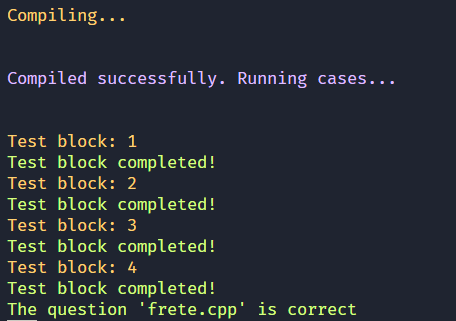
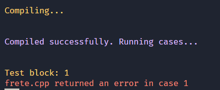
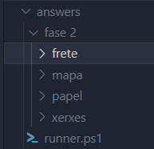
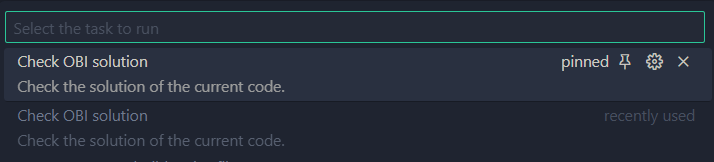

# OBI-question-checker

A vscode task to check if a C++ solution from the OBI site is correct given that the site doesn't work always. The example in this repo it's from the OBI 2017 - 2º Fase Nível Sênior.
Please keep the file struture as it was otherwise the task will not work.

## How to get the cases

Go to https://olimpiada.ic.unicamp.br/passadas/, select the year that you would like to try and download the answers.

<figure>

<figurecaption>

    Success
</figurecaption>

</figure>

<figure>

<figurecaption>

    Error
</figurecaption>

</figure>

<figure>

<figurecaption>

    file Struture
</figurecaption>

</figure>

<figure>

<figurecaption>

    task
</figurecaption>

</figure>
